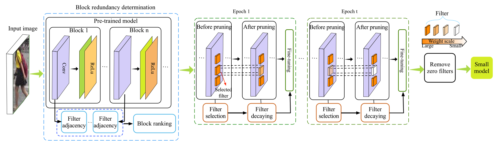

# Soft Person Reidentification Network Pruning via Blockwise Adjacent Filter Decaying
The Pytorch implementation for the paper ["Soft Person Reidentification Network Pruning via Blockwise Adjacent Filter Decaying"](https://ieeexplore.ieee.org/abstract/document/9652475). This implementation is based on [SFP](https://github.com/he-y/soft-filter-pruning), [FPGM](https://github.com/he-y/filter-pruning-geometric-median) and [Person Re-ID Baseline](https://github.com/layumi/Person_reID_baseline_pytorch). This project supports pruning three kinds of ResNet-type(18,34,50) networks on three popular re-identification datasets, including Market-1501, DukeMTMC-reID and MSMT17_V1.




## Table of Contents
- [Requirements](#requirements)
- [Dataset Preparation](#dataset-preparation)
- [Pruning ResNet](#pruning-resnet)
- [Testing ResNet](#testing-resnet)
- [Pruned Models](#pruned-models)
- [Notes](#notes)
- [Citation](#citation)


## Requirements
- Python 3.7
- PyTorch 1.3.1
- TorchVision 0.4.2

## Dataset Preparation
Download and move Market-1501, DukeMTMC-reID and MSMT17_V1 datasets into the `./datasets` folder. Note that the folder structure and folder name are as follows:
```
├── datasets
│   ├── DukeMTMC-reID
│   ├── Market
│   ├── MSMT17_V1
```
You may run the following commands to further prepare the dataset.
```bash
python prepare_market.py          # for Market-1501
python prepare_duke.py.           # for DukeMTMC-reID
python prepare_msmt.py            # for MSMT17_V1
```
Finally, the folder structure you get will look like this:
```
├── datasets
│   ├── DukeMTMC-reID
│   │   ├── bounding_box_test
│   │   ├── bounding_box_train
│   │   ├── pytorch
│   │   └── query
│   ├── Market
│   │   ├── bounding_box_test
│   │   ├── bounding_box_train
│   │   ├── gt_bbox
│   │   ├── gt_query
│   │   ├── pytorch
│   │   ├── query
│   │   └── readme.txt
│   ├── MSMT17_V1
│   │   ├── list_gallery.txt
│   │   ├── list_query.txt
│   │   ├── list_train.txt
│   │   ├── list_val.txt
│   │   ├── pytorch
│   │   ├── State-of-the-art.md
│   │   ├── test
│   │   └── train
```

## Pruning ResNet
Run `APFP_train.py` to prune ResNet on re-identification datasets using BAFD method.
```bash
# pruning ResNet18 on Market-1501 dataset
python APFP_train.py --gpu_ids 0  --decay_rate 3e-1  --efficient_pruning --network_arch resnet18 --lr 0.01 --knn 2 --prune_rate 0.90 --max_lrate 0.95   --Epochs 70 --save_epoch 60 --name prune_APFP/knn2/market/0.90/no_1x1_3e-1_70_0.01_m95_fast --train_all --batchsize 32  --data_dir ./datasets/Market/pytorch/

# pruning ResNet34 on Market-1501 dataset
python APFP_train.py --gpu_ids 0  --decay_rate 3e-1  --efficient_pruning --network_arch resnet34 --lr 0.01 --knn 2 --prune_rate 0.90 --max_lrate 0.95   --Epochs 70 --save_epoch 60 --name prune_APFP/knn2/market/0.90/no_1x1_3e-1_70_0.01_m95_fast --train_all --batchsize 32  --data_dir ./datasets/Market/pytorch/

# pruning ResNet50 on Market-1501 dataset
python APFP_train.py --gpu_ids 0  --decay_rate 3e-1  --efficient_pruning --network_arch resnet50 --lr 0.01 --knn 2 --prune_rate 0.90 --max_lrate 0.95   --Epochs 70 --save_epoch 60 --name prune_APFP/knn2/market/0.90/no_1x1_3e-1_70_0.01_m95_fast --train_all --batchsize 32  --data_dir ./datasets/Market/pytorch/

```
where the`--name` is used to set the save path for the pruned model during the pruning process. If you wish to prune the ResNet on DukeMTMC-reID or MSMT17_V1 datasets, please set the option `--data_dir` to `./datasets/DukeMTMC-reID/pytorch/` or `./datasets/MSMT17_V1/pytorch/`, respectively.


## Testing ResNet
### Performance evaluation of the pruned model with zeros
Run `test.py` and `evaluate_gpu.py` in turn for evaluating performance (containing mAP, Rank-1, Rank-5 and Rank-10 metrics) of the pruned model with zeros.
```bash
# testing ResNet18 on Market-1501 dataset
python test.py --gpu_ids 1 --network_arch resnet18 --name ./results/ft_resnet18/prune_APFP/knn2/market/0.90/no_1x1_3e-1_70_0.01_m95_fast/ --test_dir ./datasets/Market/pytorch/  --which_epoch last
python evaluate_gpu.py

# testing ResNet34 on Market-1501 dataset
python test.py --gpu_ids 1 --network_arch resnet34 --name ./results/ft_resnet34/prune_APFP/knn2/market/0.90/no_1x1_3e-1_70_0.01_m95_fast/ --test_dir ./datasets/Market/pytorch/  --which_epoch last
python evaluate_gpu.py

# testing ResNet50 on Market-1501 dataset
python test.py --gpu_ids 1 --network_arch resnet50 --name ./results/ft_resnet50/prune_APFP/knn2/market/0.90/no_1x1_3e-1_70_0.01_m95_fast/ --test_dir ./datasets/Market/pytorch/  --which_epoch last
python evaluate_gpu.py
```
where the `--which_epoch` indicates which epoch saved model is chosen to evaluate the performance, the `--name` is the full save path of the pruned model during the pruning process，the `--test_dir` means the path of testing dataset. You can evaluate the performance of different depth ResNet on different re-identification datasets by setting the options `--network_arch`, `--name` and `--test_dir`.

### Performance evaluation of the pruned model without zeros（small model）
Run `test_small.py` and `evaluate_gpu.py` in turn for getting and evaluating performance of the small model.
```bash
# testing small ResNet18 on Market-1501 dataset
python test_small.py --gpu_ids 1 --network_arch resnet18 --name ./results/ft_resnet18/prune_APFP/knn2/market/0.90/no_1x1_3e-1_70_0.01_m95_fast/ --NonL1 --test_dir ./datasets/Market/pytorch  --which_epoch last
python evaluate_gpu.py

# testing small ResNet34 on Market-1501 dataset
python test_small.py --gpu_ids 1 --network_arch resnet34 --name ./results/ft_resnet34/prune_APFP/knn2/market/0.90/no_1x1_3e-1_70_0.01_m95_fast/ --NonL1 --test_dir ./datasets/Market/pytorch  --which_epoch last
python evaluate_gpu.py

# testing small ResNet50 on Market-1501 dataset
python test_small.py --gpu_ids 1 --network_arch resnet50 --name ./results/ft_resnet50/prune_APFP/knn2/market/0.90/no_1x1_3e-1_70_0.01_m95_fast/ --NonL1 --test_dir ./datasets/Market/pytorch  --which_epoch last
python evaluate_gpu.py
```

## Pruned Models
The pruned ResNet models with zeros on different re-identification datasets can be found in [Goole Drive](https://drive.google.com/drive/folders/1ajjq3NLiseyEnyQ0ls9N0dgPje0Nv66R?usp=drive_link). If you wish to get pruned model without zeros, please refer to the `test_small.py` file.

The `resnet18_prune_rate_0.90_on_market_1501_Rank@1_0.690618_Rank@5_0.853919_Rank@10_0.903800_mAP_0.475032.pth` file denotes the pruned ResNet-18 model (pruning rate = 90%) with zeros on Market-1501 dataset.

The `resnet34_prune_rate_0.90_on_dukemtmc_Rank@1_0.709605_Rank@5_0.833034_Rank@10_0.876122_mAP_0.503515.pth` file denotes the pruned ResNet-34 model (pruning rate = 90%) with zeros on DukeMTMC-reID dataset.

The `resnet50_prune_rate_0.90_on_msmt17_ Rank@1_0.254053_Rank@5_0.396689_Rank@10_0.463076_mAP_0.136608.pth` file denotes the pruned ResNet-50 model (pruning rate = 90%) with zeros on MSMT17_V1 dataset.

## Notes
- To prune the ResNet using HFP (`L1_train.py`), SFP (`SFP_train.py`) or FPGM (`FPGM_train.py`) methods, see the scripts in the directory `./scripts`.
- `test_small.py` is used to extract the small model (without zeros) after pruning. When using for HFP, the `--prune_rate` should be set. When using for SFP, FPGM and BAFD, the `--NonL1` option should be set.
- For the comparison of inference efficiency, please refer to the `runtime_compaison.py` file.


## Citation
Please cite this paper if it helps your research:
```
@article{wang2021soft,
  title={Soft person reidentification network pruning via blockwise adjacent filter decaying},
  author={Wang, Xiaodong and Zheng, Zhedong and He, Yang and Yan, Fei and Zeng, Zhiqiang and Yang, Yi},
  journal={IEEE Transactions on Cybernetics},
  volume={52},
  number={12},
  pages={13293--13307},
  year={2021},
  publisher={IEEE}
}
```
```
@article{wang2023progressive,
  title={Progressive local filter pruning for image retrieval acceleration},
  author={Wang, Xiaodong and Zheng, Zhedong and He, Yang and Yan, Fei and Zeng, Zhiqiang and Yang, Yi},
  journal={IEEE Transactions on Multimedia},
  year={2023},
  publisher={IEEE}
}
```
